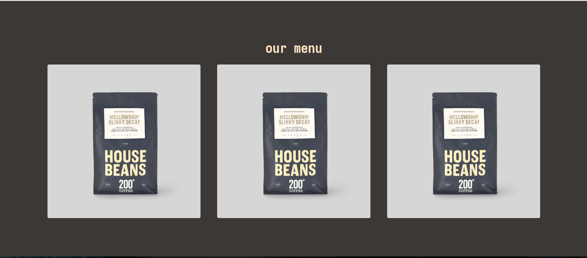
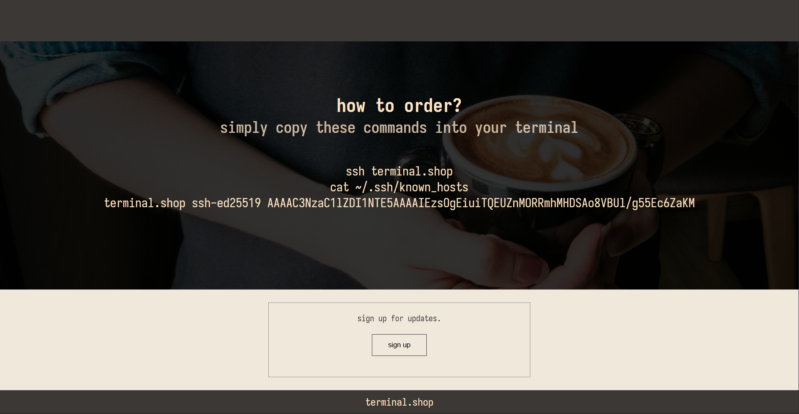

This is a simple webpage to practice my html and css fundamentals. I thought it would be a fun little project to make a landing page for [terminal.shop](https://www.terminal.shop/) which is literally a way to buy your coffee via terminal made by [teej_dv](https://x.com/teej_dv). 

I couldn't find pictures of the products they actually use so I just resorted to a random brazilian coffee company I found on google. This was fun to create, I'm looking forward to keep on learning. 

This project also taught me about markdown since it's the first project I push with an actual README. 